# FinSight AI - Arquitectura Completa del Sistema

> **Nota de estado (2026-08-11):** este documento describe el diseño objetivo del sistema. No todo lo que aparece acá está implementado — varios workers/supervisors del diagrama de abajo no existen todavía o existen pero están rotos (los 3 supervisors `_langgraph`, RAG, knowledge graph, vector search, Report Synthesizer, Critic Agent, Strategic Orchestrator). Para saber qué corre realmente hoy, ver **[PROJECT_STATUS.md](./PROJECT_STATUS.md)**.

## Diagrama de Jerarquía de 3 Niveles

```mermaid
graph TB
    subgraph "👤 User Layer"
        U[Usuario/Cliente]
    end
    
    subgraph "🎯 Nivel 1 - Strategic Layer"
        SO[Strategic Orchestrator<br/>📋 Plan & Execute<br/>💰 Cost Estimator<br/>✅ Human Approval Gateway]
        
        style SO fill:#FF6B6B,stroke:#C92A2A,stroke-width:3px
    end
    
    subgraph "👥 Nivel 2 - Supervision Layer"
        direction LR
        
        subgraph "Macro & Market Supervisor"
            MMS[Macro & Market<br/>Supervisor]
            style MMS fill:#4ECDC4,stroke:#0B7285,stroke-width:2px
        end
        
        subgraph "Fundamental Supervisor"
            FAS[Fundamental Analysis<br/>Supervisor]
            style FAS fill:#95E1D3,stroke:#087F5B,stroke-width:2px
        end
        
        subgraph "News & Sentiment Supervisor"
            NSS[News & Sentiment<br/>Supervisor]
            style NSS fill:#F9CA24,stroke:#F79F1F,stroke-width:2px
        end
    end
    
    subgraph "⚙️ Nivel 3 - Workers Layer"
        direction TB
        
        subgraph "Macro Workers"
            MDW[MacroDataWorker<br/>📊 BCRA, Alpha Vantage]
            RCW[RegionalContextWorker<br/>🌎 Tavily, NewsAPI]
            IAW[IndicatorAnalysisWorker<br/>📈 Technical Indicators]
            
            style MDW fill:#A8DADC
            style RCW fill:#A8DADC
            style IAW fill:#A8DADC
        end
        
        subgraph "Fundamental Workers"
            SFW[SECFilingsWorker<br/>📄 SEC EDGAR + RAG]
            RCaW[RatioCalculatorWorker<br/>🔢 Financial Ratios]
            CW[ComparativeWorker<br/>📊 Sector Comparison]
            GRW[GraphRelationshipWorker<br/>🕸️ Neo4j Queries]
            
            style SFW fill:#B8E6D5
            style RCaW fill:#B8E6D5
            style CW fill:#B8E6D5
            style GRW fill:#B8E6D5
        end
        
        subgraph "Sentiment Workers"
            NIW[NewsIngestionWorker<br/>📰 News Search]
            SW[SentimentWorker<br/>😊😐😢 ML Model]
            EDW[EventDetectionWorker<br/>⚡ Material Events]
            CDW[ContradictionDetectorWorker<br/>⚠️ Conflicts]
            
            style NIW fill:#FFE7A0
            style SW fill:#FFE7A0
            style EDW fill:#FFE7A0
            style CDW fill:#FFE7A0
        end
    end
    
    subgraph "📝 Synthesis Layer"
        RS[Report Synthesizer<br/>📊 Multi-section Report]
        CA[Critic Agent<br/>✅ RAGAS Validation<br/>🔄 Faithfulness Loop]
        
        style RS fill:#A29BFE,stroke:#6C5CE7,stroke-width:2px
        style CA fill:#FD79A8,stroke:#E84393,stroke-width:2px
    end
    
    subgraph "💾 Storage & Memory"
        DT[(Delta Tables<br/>Reports & Metadata)]
        VS[(Vector Search<br/>Memory RAG)]
        MLF[(MLflow<br/>Versioning & Metrics)]
        
        style DT fill:#74B9FF
        style VS fill:#74B9FF
        style MLF fill:#74B9FF
    end
    
    subgraph "🔧 Infrastructure"
        LG[LangGraph<br/>Workflow Engine]
        LS[LangSmith<br/>Tracing & Observability]
        MR[Model Router<br/>GPT-4o / Claude / Haiku]
        
        style LG fill:#DFE6E9
        style LS fill:#DFE6E9
        style MR fill:#DFE6E9
    end
    
    %% Conexiones Usuario -> Orchestrator
    U -->|Research Objective| SO
    
    %% Orchestrator -> Supervisors (Parallel)
    SO ==>|Parallel Execution| MMS
    SO ==>|Parallel Execution| FAS
    SO ==>|Parallel Execution| NSS
    
    %% Supervisors -> Workers
    MMS --> MDW
    MMS --> RCW
    MMS --> IAW
    
    FAS --> SFW
    FAS --> RCaW
    FAS --> CW
    FAS --> GRW
    
    NSS --> NIW
    NSS --> SW
    NSS --> EDW
    NSS --> CDW
    
    %% Workers -> Supervisors (Results)
    MDW -.->|Results| MMS
    RCW -.->|Results| MMS
    IAW -.->|Results| MMS
    
    SFW -.->|Results| FAS
    RCaW -.->|Results| FAS
    CW -.->|Results| FAS
    GRW -.->|Results| FAS
    
    NIW -.->|Results| NSS
    SW -.->|Results| NSS
    EDW -.->|Results| NSS
    CDW -.->|Results| NSS
    
    %% Supervisors -> Synthesizer
    MMS ==>|Macro Context| RS
    FAS ==>|Fundamental Data| RS
    NSS ==>|Sentiment Analysis| RS
    
    %% Synthesizer -> Critic Loop
    RS -->|Draft Report| CA
    CA -->|Feedback| RS
    CA -->|Approved Report| U
    
    %% Storage Connections
    CA -.->|Store Report| DT
    CA -.->|Store Embeddings| VS
    CA -.->|Log Metrics| MLF
    
    %% Infrastructure Connections
    SO -.->|Uses| LG
    SO -.->|Traces| LS
    RS -.->|Routes Models| MR
    CA -.->|Routes Models| MR
```



## Descripción de Capas

### 👤 User Layer
**Interacción inicial del usuario con el sistema**
- Input: Objetivo de investigación (ej: "Analizar riesgo de inversión en sector energético argentino")
- Output: Reporte completo con citaciones

### 🎯 Nivel 1 - Strategic Orchestrator
**El "cerebro" del sistema**

**Responsabilidades:**
- Descomponer objetivos complejos en sub-tareas
- Estimar costos y tiempos
- Human-in-the-loop para decisiones costosas
- Replanning dinámico si es necesario

**Herramientas:**
- LangGraph para workflow orchestration
- Cost estimator
- Human approval gateway (webhook)

### 👥 Nivel 2 - Supervisors
**Coordinadores especializados por dominio**

#### Macro & Market Supervisor
- **Rol**: Contexto macroeconómico y mercados
- **Workers**: 3 (MacroDataWorker, RegionalContextWorker, IndicatorAnalysisWorker)
- **Fuentes**: BCRA, Alpha Vantage, Tavily, NewsAPI

#### Fundamental Analysis Supervisor
- **Rol**: Análisis fundamental de empresas
- **Workers**: 4 (SECFilingsWorker, RatioCalculatorWorker, ComparativeWorker, GraphRelationshipWorker)
- **Fuentes**: SEC EDGAR, Neo4j Knowledge Graph

#### News & Sentiment Supervisor
- **Rol**: Análisis de noticias y sentimiento del mercado
- **Workers**: 4 (NewsIngestionWorker, SentimentWorker, EventDetectionWorker, ContradictionDetectorWorker)
- **Fuentes**: NewsAPI, Sentiment ML Model

### ⚙️ Nivel 3 - Specialized Workers
**11 workers con tareas específicas**

**Características comunes:**
- Input estructurado del supervisor
- Output con nivel de confianza y fuentes
- Timeout y retry logic
- Cache para evitar llamadas duplicadas

### 📝 Synthesis Layer

#### Report Synthesizer
**Generación del reporte final**
- Agrega resultados de los 3 supervisores
- Genera secciones estructuradas:
  - Executive Summary
  - Macro Context
  - Fundamental Analysis
  - Market Sentiment
  - Risk Assessment
  - Conclusions

#### Critic Agent
**Validación de calidad con RAGAS**
- Evalúa faithfulness contra fuentes
- Identifica claims sin respaldo
- Calcula confidence score por sección
- Loop iterativo hasta aprobar (max 3 iterations)

### 💾 Storage & Memory

**Delta Tables:**
- Reportes completos + metadata
- Versionado de investigaciones

**Vector Search:**
- Embeddings de investigaciones previas
- Memory RAG para contexto histórico

**MLflow:**
- Tracking de modelos (sentiment)
- Métricas de evaluación
- Versioning de experimentos

### 🔧 Infrastructure

**LangGraph:**
- Workflow engine para coordinación
- Parallel execution de supervisors
- Conditional edges para critic loop

**LangSmith:**
- Tracing completo de cada agente
- Latencia por step
- Cost tracking por llamada

**Model Router:**
- Task classifier para routing inteligente
- GPT-4o para synthesis (alta calidad)
- Claude Haiku para grading (bajo costo)
- GPT-4o-mini para extraction (balance)

## Flujo de Datos

### 1. Entrada
```
Usuario → Strategic Orchestrator
Input: {"objective": "...", "depth": "comprehensive"}
```

### 2. Planning
```
Orchestrator analiza → Genera plan
Output: {"dimensions": [...], "estimated_cost": 150, "requires_approval": true}
```

### 3. Aprobación (opcional)
```
Si cost > threshold → Webhook → Usuario aprueba/rechaza
```

### 4. Ejecución Paralela
```
Orchestrator dispara 3 supervisors en paralelo
Cada supervisor coordina sus workers
Timeouts y retry logic por worker
```

### 5. Agregación
```
Supervisors devuelven resultados estructurados
Synthesizer recibe: {macro: {...}, fundamental: {...}, sentiment: {...}}
```

### 6. Generación del Reporte
```
Synthesizer genera draft con múltiples secciones
Cada sección tiene fuentes citadas
```

### 7. Critic Loop
```
Critic evalúa faithfulness con RAGAS
Si score < threshold → Feedback específico → Regenerar secciones problemáticas
Loop hasta aprobar o max_iterations
```

### 8. Entrega y Storage
```
Reporte aprobado → Usuario
Almacenar en Delta Tables, Vector Search, MLflow
```

## Métricas Clave

| Métrica | Valor Típico |
|---------|-------------|
| Latencia total | 3-5 minutos |
| Workers en paralelo | 11 |
| Cost promedio | $50-150 USD |
| Faithfulness score | >0.85 |
| Cache hit rate | ~40% |
| Iterations del critic | 1-2 |

## Principios de Diseño

1. **Fail-safe**: Cada nivel tiene fallbacks y error handling
2. **Observability**: Tracing completo con LangSmith
3. **Cost optimization**: Model routing por complejidad
4. **Parallelization**: Supervisors ejecutan en paralelo
5. **Quality assurance**: Critic loop con RAGAS

---

**Versión**: 1.0.0  
**Fecha**: 2026-07-23  
**Proyecto**: FinSight AI - Agentic Platform

---
---

# 🏗️ Anexo: Arquitectura Multi-Agent Jerárquica (Cambio de Paradigma Workers → Agents)

> Documento originalmente en `ARCHITECTURE.md` (raíz del repo), fusionado aquí el 2026-08-11. Describe en detalle el cambio de paradigma de Workers a Agents, con foco inicial en el dominio Fundamental.

## 📋 Índice
1. [Cambio de Paradigma](#cambio-de-paradigma)
2. [Arquitectura Anterior vs Nueva](#arquitectura-anterior-vs-nueva-anexo)
3. [Componentes Principales](#componentes-principales-anexo)
4. [Patrón ReAct](#patrón-react-anexo)
5. [Flujo de Ejecución](#flujo-de-ejecución-anexo)
6. [Cómo Extender](#cómo-extender-anexo)

---

## 🎯 Cambio de Paradigma

### ❌ Arquitectura Anterior (Workers)

```python
class FinancialStatementWorker:
    def analyze_statements(self, ticker, query):
        # Solo HTTP call
        response = requests.get(API_URL)
        return {"data": response.json()}
```

**Problemas:**
- Workers eran solo **funciones de datos** (data fetchers)
- No razonamiento, no LLM
- Supervisor orquestaba **funciones simples**
- NO era arquitectura multi-agent verdadera

### ✅ Nueva Arquitectura (Agents)

```python
@tool
def fetch_financial_statements(ticker: str) -> str:
    # LangChain tool wraps API call
    response = requests.get(API_URL)
    return formatted_data

agent = create_react_agent(
    model=llm,                    # Tiene su propio LLM
    tools=[fetch_financial_statements],  # Usa tools
    prompt="You are a financial analyst..."  # Puede razonar
)
```

**Beneficios:**
- Agents son **agentes inteligentes** con LLM
- Pueden **razonar sobre los datos** (ReAct pattern)
- Supervisor coordina **agents autónomos**
- **Verdadera arquitectura multi-agent jerárquica**

---

## 📊 Arquitectura Anterior vs Nueva {#arquitectura-anterior-vs-nueva-anexo}

| Aspecto | Workers (❌ Anterior) | Agents (✅ Nueva) |
|---------|----------------------|-------------------|
| **Definición** | Clases Python simples | `create_react_agent` con LLM |
| **Razonamiento** | ❌ No (solo HTTP call) | ✅ Sí (ReAct pattern) |
| **LLM** | ❌ No tiene | ✅ Cada agent tiene su propio LLM |
| **Tools** | ❌ No usa tools | ✅ Tools de LangChain |
| **Iteración** | ❌ Ejecuta una vez | ✅ Puede iterar y refinar |
| **Supervisor** | StateGraph manual | StateGraph coordinando agents |
| **Tipo** | Data fetchers | Agents inteligentes |

---

## 🧩 Componentes Principales {#componentes-principales-anexo}

### 1. **Agents (fundamental_agents.py)**

Cada agent es un `create_react_agent` con:
- **Su propio LLM** → Puede razonar
- **Tools específicas** → Wrappean APIs
- **Prompt especializado** → Define su rol

```python
# Example: Financial Statement Agent
agent = create_react_agent(
    model=llm,
    tools=[fetch_financial_statements],  # LangChain tool
    prompt=(
        "You are a financial statement analyst.\\n"
        "Analyze balance sheets, income statements, cash flow.\\n"
        "Use fetch_financial_statements tool to get data.\\n"
        "Provide clear analysis of financial health."
    ),
    name="financial_statement_agent"
)
```

**4 Fundamental Agents:**
1. `financial_statement_agent` → Analiza estados financieros
2. `key_ratios_agent` → Calcula ratios (P/E, ROE, etc.)
3. `earnings_agent` → Analiza earnings y EPS
4. `valuation_agent` → Estima valoración (DCF)

### 2. **Tools (LangChain Tools)**

Cada tool es un wrapper de API que:
- Hace la llamada HTTP
- Formatea la respuesta
- Retorna string interpretable por el LLM

```python
@tool
def fetch_financial_statements(ticker: str) -> str:
    """Fetch financial statements from Alpha Vantage."""
    api_key = os.environ.get('ALPHA_VANTAGE_API_KEY')
    response = requests.get(API_URL, params={'symbol': ticker, 'apikey': api_key})
    data = response.json()
    
    # Format for LLM
    return f"""
    Financial Statements for {ticker}:
    - Revenue: ${data['revenue']}
    - Net Income: ${data['net_income']}
    - Free Cash Flow: ${data['fcf']}
    """
```

**4 Fundamental Tools:**
- `fetch_financial_statements` → Alpha Vantage API
- `fetch_key_ratios` → Financial Modeling Prep API
- `fetch_earnings_data` → Financial Modeling Prep API
- `calculate_valuation` → In-house DCF model

### 3. **Supervisor (fundamental_supervisor_v2.py)**

El supervisor coordina agents usando **StateGraph**:

```python
workflow = StateGraph(MessagesState)

# Add agents as nodes
workflow.add_node("financial_agent", financial_agent_node)
workflow.add_node("ratios_agent", ratios_agent_node)
workflow.add_node("earnings_agent", earnings_agent_node)
workflow.add_node("valuation_agent", valuation_agent_node)

# Sequential execution
workflow.add_edge(START, "financial_agent")
workflow.add_edge("financial_agent", "ratios_agent")
workflow.add_edge("ratios_agent", "earnings_agent")
workflow.add_edge("earnings_agent", "valuation_agent")
workflow.add_edge("valuation_agent", END)
```

**Flow:**
```
START → financial_agent → ratios_agent → earnings_agent → valuation_agent → END
```

---

## 🔁 Patrón ReAct {#patrón-react-anexo}

### ¿Qué es ReAct?

**Re**asoning + **Act**ing = **ReAct**

Un agent ReAct **alterna entre razonamiento y acción**:

```
User Query: "Analyze Apple financial health"

Agent Reasoning (Thought):
"I need to get Apple's financial statements first"

Agent Action:
Uses tool: fetch_financial_statements(ticker="AAPL")

Tool Response:
"Revenue: $394B, Net Income: $97B, FCF: $111B"

Agent Reasoning (Thought):
"Strong financials. Now I'll interpret this data..."

Agent Final Answer:
"Apple shows excellent financial health with:
- Strong revenue of $394B
- High profitability: $97B net income
- Robust cash generation: $111B FCF
This indicates a financially stable company."
```

### Ventajas del ReAct Pattern:

1. **Iteración inteligente** → Agent puede llamar múltiples tools
2. **Razonamiento explícito** → Podemos ver su proceso de pensamiento
3. **Auto-corrección** → Puede refinar su análisis
4. **Flexibilidad** → No está limitado a una sola llamada API

---

## 🔄 Flujo de Ejecución {#flujo-de-ejecución-anexo}

### Ejemplo: "Analyze Tesla fundamentals"

```
1. User Query
   ↓
2. Supervisor recibe query
   ↓
3. financial_agent invocado
   ├─ Thought: "I need Tesla's financial statements"
   ├─ Action: fetch_financial_statements("TSLA")
   ├─ Response: "Revenue: $96B, Net Income: $15B..."
   └─ Analysis: "Strong revenue growth..."
   ↓
4. ratios_agent invocado
   ├─ Thought: "I need Tesla's key ratios"
   ├─ Action: fetch_key_ratios("TSLA")
   ├─ Response: "P/E: 60, ROE: 28%..."
   └─ Analysis: "High valuation multiples..."
   ↓
5. earnings_agent invocado
   ├─ Thought: "I need Tesla's earnings data"
   ├─ Action: fetch_earnings_data("TSLA")
   ├─ Response: "EPS Beat by 15%..."
   └─ Analysis: "Consistently beating estimates..."
   ↓
6. valuation_agent invocado
   ├─ Thought: "I'll estimate Tesla's fair value"
   ├─ Action: calculate_valuation(revenue=96B, fcf=15B)
   ├─ Response: "DCF EV: $800B..."
   └─ Analysis: "Currently trading at premium..."
   ↓
7. Supervisor retorna análisis completo
```

---

## 🔧 Cómo Extender {#cómo-extender-anexo}

### Crear Nuevos Agents (Ejemplo: Macro Domain)

#### 1. Crear Tools (`macro_agents.py`)

```python
from langchain_core.tools import tool

@tool
def fetch_macro_indicators(country: str) -> str:
    """Fetch macro indicators from FRED API."""
    # API call to FRED
    response = requests.get(FRED_URL)
    return formatted_indicators

@tool
def fetch_regional_context(region: str) -> str:
    """Fetch regional economic context."""
    # API call
    return formatted_context
```

#### 2. Crear Agents

```python
from langgraph.prebuilt import create_react_agent

def create_macro_data_agent(llm=None):
    if llm is None:
        llm = init_chat_model("openai:gpt-4o-mini")
    
    agent = create_react_agent(
        model=llm,
        tools=[fetch_macro_indicators],
        prompt=(
            "You are a macro economist agent.\\n"
            "Analyze GDP, inflation, unemployment data.\\n"
            "Use fetch_macro_indicators tool."
        ),
        name="macro_data_agent"
    )
    return agent
```

#### 3. Crear Supervisor

```python
from langgraph.graph import StateGraph, MessagesState, START, END

def create_macro_supervisor(llm=None):
    if llm is None:
        llm = init_chat_model("openai:gpt-4o-mini")
    
    # Create agents
    macro_agent = create_macro_data_agent(llm)
    regional_agent = create_regional_context_agent(llm)
    
    # Build graph
    workflow = StateGraph(MessagesState)
    
    workflow.add_node("macro_agent", lambda s: macro_agent.invoke(s))
    workflow.add_node("regional_agent", lambda s: regional_agent.invoke(s))
    
    workflow.add_edge(START, "macro_agent")
    workflow.add_edge("macro_agent", "regional_agent")
    workflow.add_edge("regional_agent", END)
    
    return workflow.compile()
```

---

## 📁 Estructura de Archivos (Anexo)

```
agentic-ai-platform/
├── src/
│   ├── agents/
│   │   ├── fundamental_agents.py      # ✅ Agents + Tools
│   │   ├── macro_agents.py            # 🔜 TO-DO
│   │   ├── news_agents.py             # 🔜 TO-DO
│   │   └── supervisors/
│   │       ├── fundamental_supervisor_v2.py   # ✅ Supervisor
│   │       ├── macro_supervisor_v2.py         # 🔜 TO-DO
│   │       └── news_supervisor_v2.py          # 🔜 TO-DO
│   ├── workers/                       # ❌ DEPRECATED
│   │   └── fundamental.py             # Old worker classes
│   └── utils/
│       └── config.py
├── validate_all_workers_api.ipynb     # ✅ Validation notebook
└── ARCHITECTURE.md                    # ✅ This file (nota: fusionado a docs/ARCHITECTURE.md el 2026-08-11)
```

---

## ✅ Status Actual (Anexo, al 2026-07-30)

### Completado:
- ✅ **fundamental_agents.py** → 4 agents + 4 tools
- ✅ **fundamental_supervisor_v2.py** → Supervisor with StateGraph
- ✅ **validate_all_workers_api** → Updated notebook with agent tests

### Pendiente:
- 🔜 **macro_agents.py** → Convertir macro workers a agents
- 🔜 **news_agents.py** → Convertir news workers a agents
- 🔜 **Master orchestrator** → Top-level supervisor coordinando fundamental + macro + news

---

## 🎯 Diferencia Clave

**Workers = Data fetchers** (fetch data, return dict)  
**Agents = Intelligent analysts** (fetch data, **reason**, interpret, provide insights)

La nueva arquitectura permite que cada componente **piense** sobre los datos, no solo obtenerlos.

---

## 📚 Referencias

- **LangGraph Documentation**: https://langchain-ai.github.io/langgraph/
- **ReAct Paper**: https://arxiv.org/abs/2210.03629
- **8-multiagent notebook**: Patrón de referencia usado

---

**Última actualización (sección anexa):** 2026-07-30