# FinSight AI - Arquitectura Completa del Sistema

## Diagrama de Jerarquía de 3 Niveles

```mermaid
graph TB
    subgraph "👤 User Layer"
        U[Usuario/Cliente]
    end
    
    subgraph "🎯 Nivel 1 - Strategic Layer"
        SO[Strategic Orchestrator<br/>📋 Plan & Execute<br/>💰 Cost Estimator<br/>✅ Human Approval Gateway]
        
        style SO fill:#FF6B6B,stroke:#C92A2A,stroke-width:3px
    end
    
    subgraph "👥 Nivel 2 - Supervision Layer"
        direction LR
        
        subgraph "Macro & Market Supervisor"
            MMS[Macro & Market<br/>Supervisor]
            style MMS fill:#4ECDC4,stroke:#0B7285,stroke-width:2px
        end
        
        subgraph "Fundamental Supervisor"
            FAS[Fundamental Analysis<br/>Supervisor]
            style FAS fill:#95E1D3,stroke:#087F5B,stroke-width:2px
        end
        
        subgraph "News & Sentiment Supervisor"
            NSS[News & Sentiment<br/>Supervisor]
            style NSS fill:#F9CA24,stroke:#F79F1F,stroke-width:2px
        end
    end
    
    subgraph "⚙️ Nivel 3 - Workers Layer"
        direction TB
        
        subgraph "Macro Workers"
            MDW[MacroDataWorker<br/>📊 BCRA, Alpha Vantage]
            RCW[RegionalContextWorker<br/>🌎 Tavily, NewsAPI]
            IAW[IndicatorAnalysisWorker<br/>📈 Technical Indicators]
            
            style MDW fill:#A8DADC
            style RCW fill:#A8DADC
            style IAW fill:#A8DADC
        end
        
        subgraph "Fundamental Workers"
            SFW[SECFilingsWorker<br/>📄 SEC EDGAR + RAG]
            RCaW[RatioCalculatorWorker<br/>🔢 Financial Ratios]
            CW[ComparativeWorker<br/>📊 Sector Comparison]
            GRW[GraphRelationshipWorker<br/>🕸️ Neo4j Queries]
            
            style SFW fill:#B8E6D5
            style RCaW fill:#B8E6D5
            style CW fill:#B8E6D5
            style GRW fill:#B8E6D5
        end
        
        subgraph "Sentiment Workers"
            NIW[NewsIngestionWorker<br/>📰 News Search]
            SW[SentimentWorker<br/>😊😐😢 ML Model]
            EDW[EventDetectionWorker<br/>⚡ Material Events]
            CDW[ContradictionDetectorWorker<br/>⚠️ Conflicts]
            
            style NIW fill:#FFE7A0
            style SW fill:#FFE7A0
            style EDW fill:#FFE7A0
            style CDW fill:#FFE7A0
        end
    end
    
    subgraph "📝 Synthesis Layer"
        RS[Report Synthesizer<br/>📊 Multi-section Report]
        CA[Critic Agent<br/>✅ RAGAS Validation<br/>🔄 Faithfulness Loop]
        
        style RS fill:#A29BFE,stroke:#6C5CE7,stroke-width:2px
        style CA fill:#FD79A8,stroke:#E84393,stroke-width:2px
    end
    
    subgraph "💾 Storage & Memory"
        DT[(Delta Tables<br/>Reports & Metadata)]
        VS[(Vector Search<br/>Memory RAG)]
        MLF[(MLflow<br/>Versioning & Metrics)]
        
        style DT fill:#74B9FF
        style VS fill:#74B9FF
        style MLF fill:#74B9FF
    end
    
    subgraph "🔧 Infrastructure"
        LG[LangGraph<br/>Workflow Engine]
        LS[LangSmith<br/>Tracing & Observability]
        MR[Model Router<br/>GPT-4o / Claude / Haiku]
        
        style LG fill:#DFE6E9
        style LS fill:#DFE6E9
        style MR fill:#DFE6E9
    end
    
    %% Conexiones Usuario -> Orchestrator
    U -->|Research Objective| SO
    
    %% Orchestrator -> Supervisors (Parallel)
    SO ==>|Parallel Execution| MMS
    SO ==>|Parallel Execution| FAS
    SO ==>|Parallel Execution| NSS
    
    %% Supervisors -> Workers
    MMS --> MDW
    MMS --> RCW
    MMS --> IAW
    
    FAS --> SFW
    FAS --> RCaW
    FAS --> CW
    FAS --> GRW
    
    NSS --> NIW
    NSS --> SW
    NSS --> EDW
    NSS --> CDW
    
    %% Workers -> Supervisors (Results)
    MDW -.->|Results| MMS
    RCW -.->|Results| MMS
    IAW -.->|Results| MMS
    
    SFW -.->|Results| FAS
    RCaW -.->|Results| FAS
    CW -.->|Results| FAS
    GRW -.->|Results| FAS
    
    NIW -.->|Results| NSS
    SW -.->|Results| NSS
    EDW -.->|Results| NSS
    CDW -.->|Results| NSS
    
    %% Supervisors -> Synthesizer
    MMS ==>|Macro Context| RS
    FAS ==>|Fundamental Data| RS
    NSS ==>|Sentiment Analysis| RS
    
    %% Synthesizer -> Critic Loop
    RS -->|Draft Report| CA
    CA -->|Feedback| RS
    CA -->|Approved Report| U
    
    %% Storage Connections
    CA -.->|Store Report| DT
    CA -.->|Store Embeddings| VS
    CA -.->|Log Metrics| MLF
    
    %% Infrastructure Connections
    SO -.->|Uses| LG
    SO -.->|Traces| LS
    RS -.->|Routes Models| MR
    CA -.->|Routes Models| MR
```



## Descripción de Capas

### 👤 User Layer
**Interacción inicial del usuario con el sistema**
- Input: Objetivo de investigación (ej: "Analizar riesgo de inversión en sector energético argentino")
- Output: Reporte completo con citaciones

### 🎯 Nivel 1 - Strategic Orchestrator
**El "cerebro" del sistema**

**Responsabilidades:**
- Descomponer objetivos complejos en sub-tareas
- Estimar costos y tiempos
- Human-in-the-loop para decisiones costosas
- Replanning dinámico si es necesario

**Herramientas:**
- LangGraph para workflow orchestration
- Cost estimator
- Human approval gateway (webhook)

### 👥 Nivel 2 - Supervisors
**Coordinadores especializados por dominio**

#### Macro & Market Supervisor
- **Rol**: Contexto macroeconómico y mercados
- **Workers**: 3 (MacroDataWorker, RegionalContextWorker, IndicatorAnalysisWorker)
- **Fuentes**: BCRA, Alpha Vantage, Tavily, NewsAPI

#### Fundamental Analysis Supervisor
- **Rol**: Análisis fundamental de empresas
- **Workers**: 4 (SECFilingsWorker, RatioCalculatorWorker, ComparativeWorker, GraphRelationshipWorker)
- **Fuentes**: SEC EDGAR, Neo4j Knowledge Graph

#### News & Sentiment Supervisor
- **Rol**: Análisis de noticias y sentimiento del mercado
- **Workers**: 4 (NewsIngestionWorker, SentimentWorker, EventDetectionWorker, ContradictionDetectorWorker)
- **Fuentes**: NewsAPI, Sentiment ML Model

### ⚙️ Nivel 3 - Specialized Workers
**11 workers con tareas específicas**

**Características comunes:**
- Input estructurado del supervisor
- Output con nivel de confianza y fuentes
- Timeout y retry logic
- Cache para evitar llamadas duplicadas

### 📝 Synthesis Layer

#### Report Synthesizer
**Generación del reporte final**
- Agrega resultados de los 3 supervisores
- Genera secciones estructuradas:
  - Executive Summary
  - Macro Context
  - Fundamental Analysis
  - Market Sentiment
  - Risk Assessment
  - Conclusions

#### Critic Agent
**Validación de calidad con RAGAS**
- Evalúa faithfulness contra fuentes
- Identifica claims sin respaldo
- Calcula confidence score por sección
- Loop iterativo hasta aprobar (max 3 iterations)

### 💾 Storage & Memory

**Delta Tables:**
- Reportes completos + metadata
- Versionado de investigaciones

**Vector Search:**
- Embeddings de investigaciones previas
- Memory RAG para contexto histórico

**MLflow:**
- Tracking de modelos (sentiment)
- Métricas de evaluación
- Versioning de experimentos

### 🔧 Infrastructure

**LangGraph:**
- Workflow engine para coordinación
- Parallel execution de supervisors
- Conditional edges para critic loop

**LangSmith:**
- Tracing completo de cada agente
- Latencia por step
- Cost tracking por llamada

**Model Router:**
- Task classifier para routing inteligente
- GPT-4o para synthesis (alta calidad)
- Claude Haiku para grading (bajo costo)
- GPT-4o-mini para extraction (balance)

## Flujo de Datos

### 1. Entrada
```
Usuario → Strategic Orchestrator
Input: {"objective": "...", "depth": "comprehensive"}
```

### 2. Planning
```
Orchestrator analiza → Genera plan
Output: {"dimensions": [...], "estimated_cost": 150, "requires_approval": true}
```

### 3. Aprobación (opcional)
```
Si cost > threshold → Webhook → Usuario aprueba/rechaza
```

### 4. Ejecución Paralela
```
Orchestrator dispara 3 supervisors en paralelo
Cada supervisor coordina sus workers
Timeouts y retry logic por worker
```

### 5. Agregación
```
Supervisors devuelven resultados estructurados
Synthesizer recibe: {macro: {...}, fundamental: {...}, sentiment: {...}}
```

### 6. Generación del Reporte
```
Synthesizer genera draft con múltiples secciones
Cada sección tiene fuentes citadas
```

### 7. Critic Loop
```
Critic evalúa faithfulness con RAGAS
Si score < threshold → Feedback específico → Regenerar secciones problemáticas
Loop hasta aprobar o max_iterations
```

### 8. Entrega y Storage
```
Reporte aprobado → Usuario
Almacenar en Delta Tables, Vector Search, MLflow
```

## Métricas Clave

| Métrica | Valor Típico |
|---------|-------------|
| Latencia total | 3-5 minutos |
| Workers en paralelo | 11 |
| Cost promedio | $50-150 USD |
| Faithfulness score | >0.85 |
| Cache hit rate | ~40% |
| Iterations del critic | 1-2 |

## Principios de Diseño

1. **Fail-safe**: Cada nivel tiene fallbacks y error handling
2. **Observability**: Tracing completo con LangSmith
3. **Cost optimization**: Model routing por complejidad
4. **Parallelization**: Supervisors ejecutan en paralelo
5. **Quality assurance**: Critic loop con RAGAS

---

**Versión**: 1.0.0  
**Fecha**: 2026-07-23  
**Proyecto**: FinSight AI - Agentic Platform